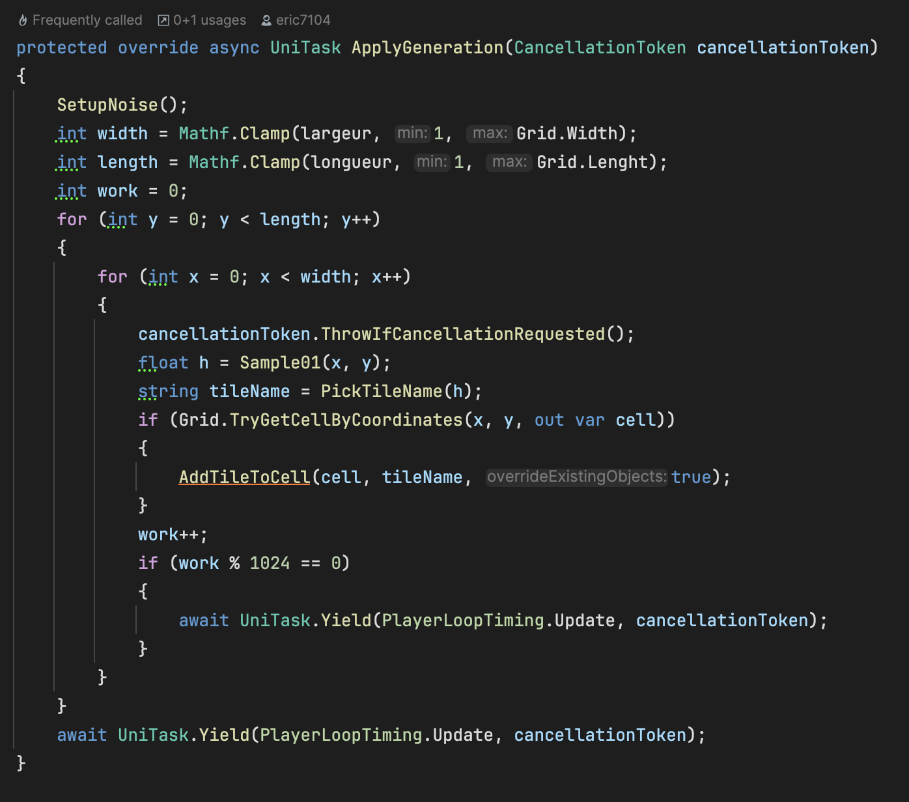
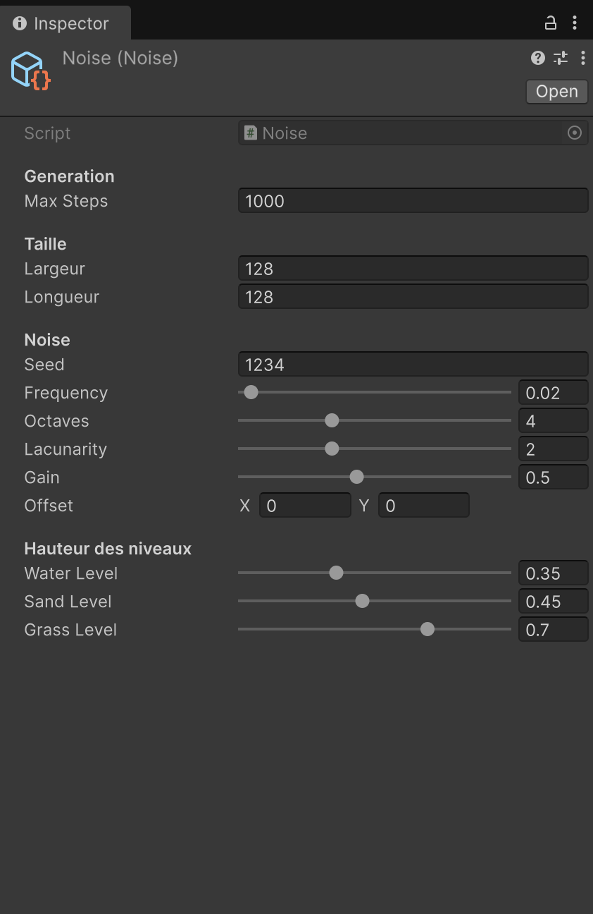

# Génération Procédurale sur Unity
*Projet génération procedural Gaming Campus*

<p align="center">
  
</p>

---

# Table des matières
1. [Fonctionnalités](#-fonctionnalités)
2. [Architecture](#-architecture)
3. [Système de Grille](#-système-de-grille)
4. [Gestion des Objets (Tiles)](#-gestion-des-objets-tiles)
5. [Pipeline de Génération](#-pipeline-de-génération)
6. [Méthodes de Génération](#-méthodes-de-génération)
   - [SimpleRoomPlacement](#1-simpleroomplacement)
   - [BSP2](#2-bsp2-bsp-classique-amélioré)
   - [Cellular Automata](#3-cellular-automata)
   - [Noise](#4-noise-opensimplex-biomes)
7. [Utilisation](#-utilisation)
8. [Extensibilité](#-extensibilité)
9. [Crédits](#-crédits)

---

# Fonctionnalités
- Grille centrée (Grid + Cell)
- Placement intelligent d’objets via Template → Factory → Controller
- Génération **asynchrone** (UniTask + cancellation)
- Génération déterministe via **RandomService**
- Plusieurs algorithmes :
  - SimpleRoomPlacement
  - BSP2
  - Cellular Automata
  - Noise-based biomes
- Debug visuel intégré
- Facile à étendre

---

# Architecture
```
ProceduralGridGenerator
│
├── ProceduralGenerationMethod (ScriptableObject)
│     ├── SimpleRoomPlacement
│     ├── BSP2
│     ├── CellularAutomata
│     └── Noise
│
├── Grid / Cell
│
└── GridObjectTemplate → GridObjectFactory → GridObjectController
```
---

# Système de Grille

## Grid
- `Width`, `Lenght` (typo volontaire), `CellSize`
- Origine centrée (`OriginPosition`)
- Fonctions clés :
  - `GetWorldPosition()`
  - `TryGetCellByCoordinates()`
  - `DrawGridDebug()`

## Cell
- Coordonnées (Vector2Int)
- Stocke un `GridObject` + son `GridObjectController`
- Méthodes :
  - `AddObject(template, override)`
  - `ClearGridObject()`

---

# Gestion des Objets (Tiles)

## GridObjectTemplate
- Nom logique (ex : Grass, Room, Water)
- Prefab Unity utilisé comme vue

## GridObjectFactory
- `SpawnOnGridFrom(template, cell)`
- Gestion complète de l’override

## GridObjectController
- Gère position, rotation et apparence

---

# Sens de Génération
1. Création de la grille  
2. Exécution de la méthode procédurale  
3. Placement des tiles  
4. Remplissage du sol (selon algo)  
5. Debug optionnel  

---

# Méthodes de Génération

## 1. SimpleRoomPlacement
- Placement de salles rectangulaires non chevauchées  
- Reliage de Couloirs   
- Remplissage des zones vides → Grass  
- Override : Rooms = true, Corridors = true

## 2. BSP
- Découpe récursive avec ratio  
- Chaque leaf génère une Room  
- Connexions hiérarchiques  
- Override sélectif  
- Non async

## 3. Cellular Automata
- Initialisation eau/herbe  
- Itérations avec règles de voisinage  
- Coût élevé sur grandes grilles  

<p align="center">
  
  
</p>

## 4. Noise
- Eau → Sable → Herbe → Rocher  
- FastNoiseLite  
- Très performant  

<p align="center">
  
  
  
</p>

---

# Utilisation
```csharp
var generator = FindObjectOfType<ProceduralGridGenerator>();
await generator.GenerateGrid();
```

Paramétrer :
- méthode (ScriptableObject)
- seed
- debug
- step delay

<p align="center">
  
</p>

---

# Extensibilité
1. Créer un ScriptableObject dérivé de `ProceduralGenerationMethod`
2. Utiliser `RandomService`
3. Utiliser `AddGridObjectToCell`
4. Gérer `cancellationToken`

---

# Crédits
- FastNoiseLite 
